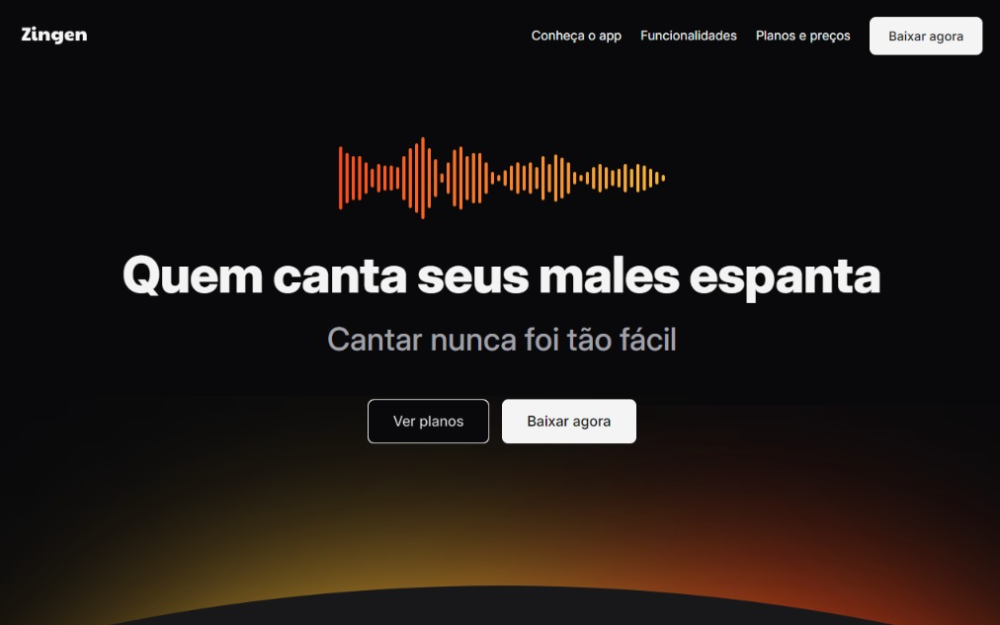

# Zingen - Plataforma de Karaokê com IA



## 📱 Sobre o Projeto

Zingen é uma plataforma de karaokê moderna que utiliza Inteligência Artificial para criar uma experiência única de canto. Desenvolvido durante o curso da Rocketseat, este projeto frontend demonstra uma landing page responsiva e moderna.

## ✨ Features Destacadas

- Remoção de voz original usando IA
- Biblioteca extensa de músicas para karaokê
- Sistema de pontuação gamificado
- Gravação de performances
- Compartilhamento com a comunidade
- Letras sincronizadas em tempo real

## 🚀 Tecnologias Utilizadas

- HTML5
- CSS3
  - CSS Grid
  - CSS Custom Properties
  - CSS Nesting
  - Flexbox
  - Media Queries para Responsividade

## 💻 Layout Responsivo

O projeto foi desenvolvido seguindo o conceito Mobile First, garantindo uma experiência consistente em diferentes dispositivos:
- Layout mobile otimizado
- Layout desktop com features expandidas
- Adaptação inteligente de componentes

## 📦 Estrutura do Projeto

```
zingen/
├── assets/
│   ├── icons/
│   ├── screenshots/
│   └── ...
├── styles/
│   ├── global.css
│   ├── utility.css
│   └── ...
└── index.html
```

## 🎯 Funcionalidades Principais

- Header com navegação responsiva
- Seção Hero com call-to-action
- Seção de Features com cards informativos
- Planos de preços
- Seção de download com links para app stores
- Footer com links úteis e social media

## 📝 Licença

Este projeto foi desenvolvido durante o curso da Rocketseat e serve apenas como portfolio.

## 🎓 Créditos

Design e conceito original: Rocketseat

---

⌨️ com ❤️ por Lucas Moura
